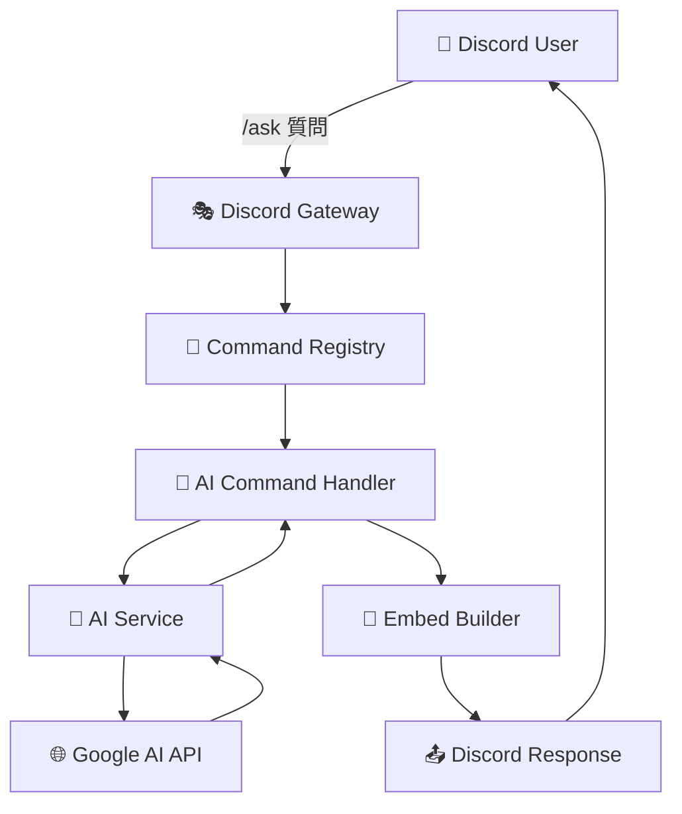

# 🏗️ Luna Bot アーキテクチャ

<div align="center">

**Clean Architecture と Dependency Injection を活用したモダンな Discord ボット設計**

[🎯 設計原則](#-設計原則) • [📁 プロジェクト構造](#-プロジェクト構造) • [🔄 データフロー](#-データフロー) • [⚡ パフォーマンス](#-パフォーマンス)

</div>

---

## 🎯 設計原則

### 🧩 Clean Architecture

Luna Bot は **Clean Architecture** に基づいて設計されており、以下の層に分離されています：

```
┌─────────────────────────────────────┐
│        🖥️  Presentation Layer       │  ← Discord UI (Commands, Interactions)
├─────────────────────────────────────┤
│        💼  Application Layer        │  ← Use Cases, Command Handlers
├─────────────────────────────────────┤
│         🏢  Domain Layer            │  ← Business Logic, Entities
├─────────────────────────────────────┤
│      🔌  Infrastructure Layer       │  ← Database, External APIs
└─────────────────────────────────────┘
```

### 🎲 Dependency Injection

```go
// DIコンテナによる依存性管理
type Container struct {
    Config          *config.Config
    Session         *discordgo.Session
    DatabaseService *database.Service
    Logger          *logging.Logger
    AIService       *ai.Service
    CommandRegistry *commands.Registry
}
```

**利点:**
- 🔄 テスタビリティの向上
- 🔧 保守性の向上
- 🚀 機能の独立性

---

## 📁 プロジェクト構造

```
Luna/
├── 🏠 cmd/bot/main.go                    # 🚀 アプリケーションエントリーポイント
│
├── 🤖 ai/                                # 🧠 AI サービス層
│   ├── vertex_gemini.go                  #   └── 新 Vertex AI Gemini API
│   ├── gemini_studio.go                  #   └── Google AI Studio API  
│   ├── service.go                        #   └── 旧 Vertex AI (Imagen)
│   └── multimodal.go                     #   └── 画像処理・OCR
│
├── 📝 commands/                          # 💬 コマンド層 (Presentation)
│   ├── command.go                        #   └── コマンドインターフェース
│   ├── registry.go                       #   └── コマンド登録・管理
│   ├── interactions.go                   #   └── モーダル・ボタン処理
│   ├── ai.go                            #   └── Luna AI コマンド
│   ├── config.go                        #   └── 設定管理コマンド
│   ├── avatar.go                        #   └── ユーザー情報コマンド
│   └── ...                              #   └── その他のコマンド
│
├── 🗄️ database/                         # 💾 データ永続化層 (Infrastructure)
│   ├── database.go                       #   └── データベース接続
│   ├── service.go                        #   └── データベースサービス
│   └── migrations.sql                    #   └── スキーマ定義
│
├── 📊 logging/                           # 📋 ログシステム (Application)
│   └── logger.go                         #   └── Discord イベントログ
│
├── 🎨 embed/                             # 🖼️ UI コンポーネント (Presentation)  
│   └── builder.go                        #   └── Material Design 3 埋め込み
│
├── ⚙️ config/                            # 🔧 設定管理 (Infrastructure)
│   └── config.go                         #   └── TOML設定読み込み
│
├── 🧩 di/                                # 💉 依存性注入 (Infrastructure)
│   └── container.go                      #   └── DIコンテナ
│
├── 🎫 bump/                              # 📢 Bump通知 (Application)
│   └── handler.go                        #   └── サーバーBump管理
│
└── 🤝 bot/                               # 🎭 Discord クライアント (Infrastructure)
    └── bot.go                            #   └── Discord セッション管理
```

---

## 🔄 データフロー

### 📨 コマンド実行フロー



### 🏗️ 依存性注入フロー

```go
// 1. コンテナ初期化
container := di.NewContainer(cfg)

// 2. 依存性の順次初期化
container.initDatabase()     // データベース接続
container.initDiscordSession() // Discord クライアント
container.initServices()     // 各種サービス
container.initCommands()     // コマンド登録

// 3. 自動的な依存性解決
commands := &AICommand{
    vertexGemini: container.VertexGemini,  // 自動注入
}
```

---

## 🚀 パフォーマンス最適化

### ⚡ 並行処理

```go
// ゴルーチンによる非同期処理
go func() {
    // AI API 呼び出し
    response, err := s.model.GenerateContent(ctx, prompt)
    responseChan <- response
}()

// メッセージキャッシュのクリーンアップ
go l.cleanupOldMessages()
```

### 💾 メッセージキャッシュシステム

```go
type MessageCache struct {
    mu       sync.RWMutex              // 並行アクセス制御
    messages map[string]*CachedMessage // メッセージストレージ
}

// キャッシュライフサイクル
onMessageCreate()  // メッセージ作成時にキャッシュ
onMessageUpdate()  // 編集時にキャッシュ更新  
onMessageDelete()  // 削除時にキャッシュから取得・削除
cleanupOldMessages() // 定期的な古いキャッシュ削除
```

### 🗄️ データベース最適化

```go
// SQLite 最適化
- WAL モード: 読み書き並行性向上
- プリペアドステートメント: SQLインジェクション防止
- 外部キー制約: データ整合性保証
- インデックス: クエリ高速化
```

---

## 🧩 主要コンポーネント

### 🎭 Discord Bot Core

```go
type Bot struct {
    session *discordgo.Session
    config  *config.Config
    db      *database.Service
}

// 責任: Discord セッション管理、接続維持
```

### 💼 Command System

```go
type Command interface {
    Name() string
    Description() string
    Execute(ctx *Context) error
    Options() []*discordgo.ApplicationCommandOption
}

// 責任: コマンド定義、実行ロジック
```

### 🧠 AI Services

```go
// マルチAIプロバイダー対応
type AIService interface {
    AskGemini(ctx context.Context, question, userID string) (string, error)
}

// 実装:
- VertexGeminiService    // 新API (推奨)
- GeminiStudioService    // 無料API
- Service               // 旧API (Imagen用)
```

### 📊 Logging System

```go
type Logger struct {
    session      *discordgo.Session
    messageCache *MessageCache  // 編集前後の内容保存
}

// 機能:
- メッセージ編集/削除の詳細ログ
- メンバー参加/退出の追跡
- 権限変更の監視
```

---

## 🔐 セキュリティアーキテクチャ

### 🛡️ 権限チェック

```go
func validatePermissions(channelID string) error {
    // ボット権限の事前確認
    perms, err := session.UserChannelPermissions(botID, channelID)
    if err != nil {
        return err
    }
    
    required := PermissionViewChannel | PermissionSendMessages
    if perms&required != required {
        return ErrInsufficientPermissions
    }
}
```

### 🔒 データ保護

```go
// 設定の暗号化サポート
type SecureConfig struct {
    Token string `toml:"token" encrypt:"true"`
    APIKey string `toml:"api_key" encrypt:"true"`  
}

// SQLインジェクション対策
stmt, err := db.Prepare("SELECT * FROM guilds WHERE id = ?")
```

---

## 🧪 テスト戦略

### 📋 テストアーキテクチャ

```
tests/
├── unit/                    # 単体テスト
│   ├── commands/           #   └── コマンドロジック
│   ├── database/           #   └── データベース操作
│   └── ai/                 #   └── AI サービス
├── integration/            # 結合テスト
│   ├── discord/           #   └── Discord API統合
│   └── ai/                #   └── AI API統合  
└── e2e/                   # E2Eテスト
    └── scenarios/         #   └── ユーザーシナリオ
```

### 🔧 モックとスタブ

```go
// AI サービスのモック
type MockAIService struct {
    responses map[string]string
}

func (m *MockAIService) AskGemini(ctx, question, userID string) (string, error) {
    return m.responses[question], nil
}

// テストでの依存性注入
container := &di.Container{
    AIService: &MockAIService{
        responses: map[string]string{
            "hello": "こんにちは！",
        },
    },
}
```

---

## 🚀 スケーラビリティ

### 📈 水平スケーリング対応

```go
// 将来のスケーリングポイント
type ShardManager struct {
    shards []*discordgo.Session
    router *CommandRouter
}

// ロードバランシング
type LoadBalancer struct {
    backends []AIService
    strategy LoadBalancingStrategy
}
```

### 💾 キャッシュ戦略

```go
// 多層キャッシュ
L1: In-Memory (MessageCache)     // 最速アクセス
L2: Redis (将来対応)             // クラスター対応
L3: Database (SQLite)            // 永続化
```

---

## 🔄 将来の拡張性

### 🧩 プラグインアーキテクチャ

```go
type Plugin interface {
    Name() string
    Initialize(container *di.Container) error
    Commands() []Command
    Handlers() []EventHandler
}

// プラグイン例
- MusicPlugin    // 音楽再生機能
- GamePlugin     // ゲーム統合
- APIPlugin      // 外部API統合
```

### 🌐 マイクロサービス対応

```
┌─────────────────┐    ┌─────────────────┐
│   Luna Core     │────│   AI Service    │
│   (Discord)     │    │   (Gemini/GPT)  │
└─────────────────┘    └─────────────────┘
         │                       │
    ┌─────────────────┐    ┌─────────────────┐
    │ Logging Service │    │ Media Service   │
    │   (Analytics)   │    │   (Images/Audio)│
    └─────────────────┘    └─────────────────┘
```

---

## 📊 メトリクスとモニタリング

### 📈 パフォーマンス監視

```go
type Metrics struct {
    CommandLatency   map[string]time.Duration
    AIRequestCount   int64
    DatabaseQueries  int64
    ActiveUsers      int64
    ErrorRate        float64
}

// 監視対象
- コマンド実行時間
- AI API レスポンス時間  
- データベースクエリ時間
- メモリ使用量
- ゴルーチン数
```

---

## 🤝 開発ガイドライン

### 📝 コーディング規約

```go
// インターフェース設計
type Service interface {
    // メソッドは動詞で始める
    ProcessRequest(ctx context.Context, req *Request) (*Response, error)
}

// エラーハンドリング
if err != nil {
    return fmt.Errorf("failed to process request: %w", err)
}

// ログ出力
log.WithFields(log.Fields{
    "user_id": userID,
    "command": commandName,
}).Info("Command executed successfully")
```

### 🔄 継続的インテグレーション

```yaml
# .github/workflows/ci.yml
name: CI
on: [push, pull_request]
jobs:
  test:
    runs-on: ubuntu-latest
    steps:
      - uses: actions/checkout@v2
      - uses: actions/setup-go@v2
        with:
          go-version: 1.24.4
      - run: go test ./...
      - run: go vet ./...
      - run: golint ./...
```

---

## 📚 参考資料

- [Clean Architecture](https://blog.cleancoder.com/uncle-bob/2012/08/13/the-clean-architecture.html) - Robert C. Martin
- [Dependency Injection in Go](https://github.com/google/wire) - Google Wire
- [Discord API Documentation](https://discord.com/developers/docs) - Discord
- [Go Best Practices](https://golang.org/doc/effective_go.html) - The Go Team